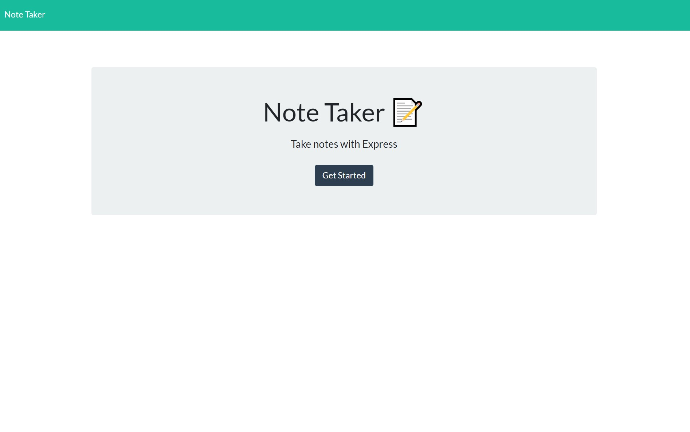
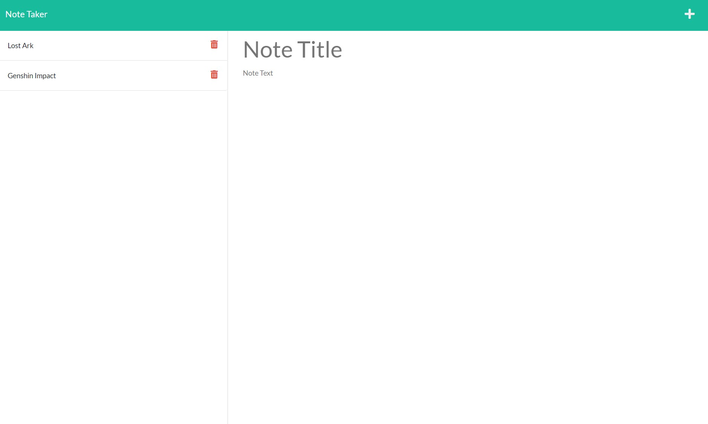

# Note Taker

## Description

This application generates a note based on the title and content the user enters in.

## Table of Contents

* [Installation](#installation)
* [Usage](#usage)
* [Contribution](#contribution)
* [Visuals](#visuals)
* [Questions](#questions)

## Installation

The application does require dependencies, so enter this code (below) into the terminal and run it:
```
npm i
```

## Usage

Note Taker is used to write and save notes. Here is how you launch the application:

1. Open the `note-taker` directory if you haven't already.
2. Run `node server.js` in the terminal to run the app.
3. Then open up your browser and enter `http:/localhost:3001` in the url link.

Guide on using Note Taker:

* To create a new note, click on the `+`.
* To save the note, click on the `save icon`.
* To remove the note, click on the `trash icon`.
* To check out new notes, click on the other notes' title.

Deployed App Link: 

## Contribution

No contributions needed.


## Visuals

Here is how Note Taker should appear when it is launched:



Here is how it looks when creating a note:



## Questions

If you have any questions and want to reach me, email me at <christylex3@gmail.com>. Also, you can check out my other work [here](https://github.com/christylex3).